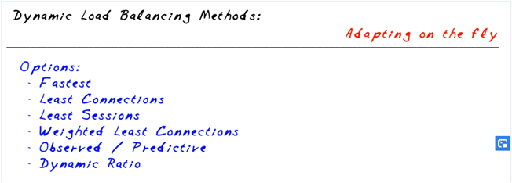

<!-- wp:list -->
<ul><li>have the habit of create alway a custom profile. Don't use the default profiles. One benefit is that it will force to look at the profile sessings (a profile is a collection of settings). For e.g. opening the OneConnect profile will show what are the liming imposed in terms of connections and timeout.</li></ul>
<!-- /wp:list -->

<!-- wp:paragraph -->

Screenshot from lesson

<!-- /wp:paragraph -->

<!-- wp:image {"id":83,"sizeSlug":"large"} -->
<figure class="wp-block-image size-large"></figure>
<!-- /wp:image -->

<!-- wp:image {"id":84,"sizeSlug":"large"} -->
<figure class="wp-block-image size-large"></figure>
<!-- /wp:image -->

<!-- wp:paragraph -->

Notes:

<!-- /wp:paragraph -->

<!-- wp:paragraph -->

■ ADC: Application Delivery Controller ■ Top application on Internet today: HTTP

<!-- /wp:paragraph -->

<!-- wp:list -->
<ul><li>Intercept, inspect and/or transform requests and/or responses. Secret: hands-on practice Good security practice VLAN: View, Lab, Access, Notes</li></ul>
<!-- /wp:list -->

<!-- wp:paragraph -->

To remember, to memorize: Health monitor interval: 5 sec Health monitor timeout: 16 sec Available, Unavailable, Offline, Unknown Ratios, Priorities, Connections (R:1 P:0 C:0) Priority activation Profile: a collections of settings

<!-- /wp:paragraph -->
